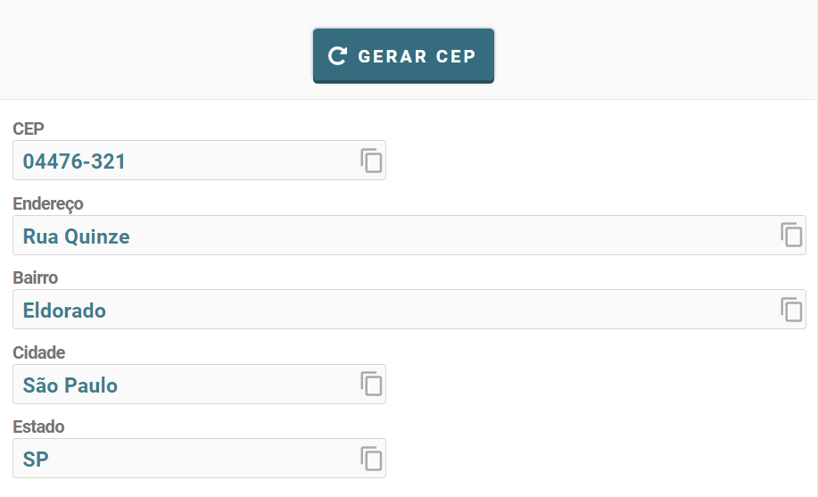
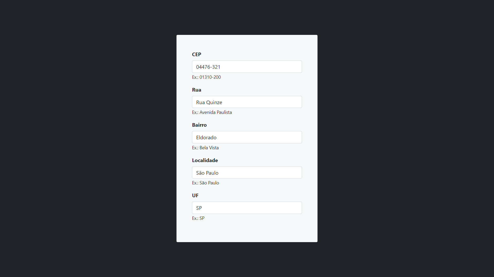

<h1>FETCH API FORM</h1>

---

<h2>Sobre o projeto 🔥</h2>

<p>Este é um projeto muito interessante no qual eu foquei o aprendizado no uso de funções assíncronas, o mesmo conta com um formulário onde o usuário insere algum CEP e a API retorna os dados dos demais campos e os preenche automaticamente.</p>

---

<h2>Acesse o projeto ⭐</h2>

<p>clique no botão abaixo para ser redirecionado para o website do projeto.</p>

<p>
    <a href="https://henriqfelix.github.io/fetch-api-form/" target="_blank">
        
    </a>
</p>

---

<h2>Buscando um CEP aleatório 🔎</h2>

<p>Neste print, é exibido o resultado que fiz em uma busca por um CEP aleatório.</p>



---

<h2>Conferindo o resultado 😉</h2>

<p>Já neste, é exibido nosso projeto, realizando o teste com o CEP aleatório gerado anteriormente</p>



---

<h2>Instruções 📓</h2>

<p>Para conseguir rodar este projeto em sua máquina, execute o seguinte código em seu git bash para instalar as dependências do bootstrap:</p>

```bash
   npm install bootstrap --save
```

<h3>Requisitos ⚠️ </h3>

- git
- npm

---

<h2>Tecnologias utilizadas 🖥️</h2>

- [HTML](https://www.w3.org/html/)
- [CSS](https://www.w3schools.com/css/default.asp)
  - [Bootstrap](https://getbootstrap.com)
- [Javascript](https://www.javascript.com)
  - [API ViaCEP](https://viacep.com.br)

---

<h2>Referências 💭</h2>

- [Vídeo](https://www.youtube.com/watch?v=Pi6wkdU2vR4&t=433s)
- [Site para gerar CEP](https://www.4devs.com.br/gerador_de_cep)
